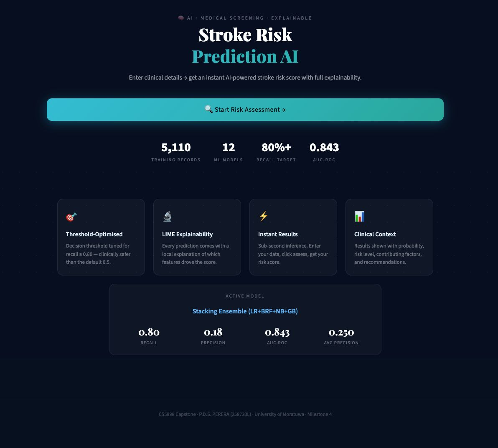
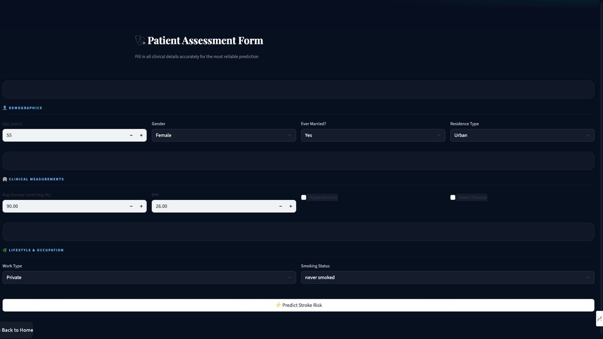
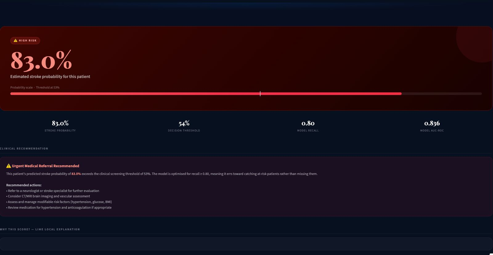
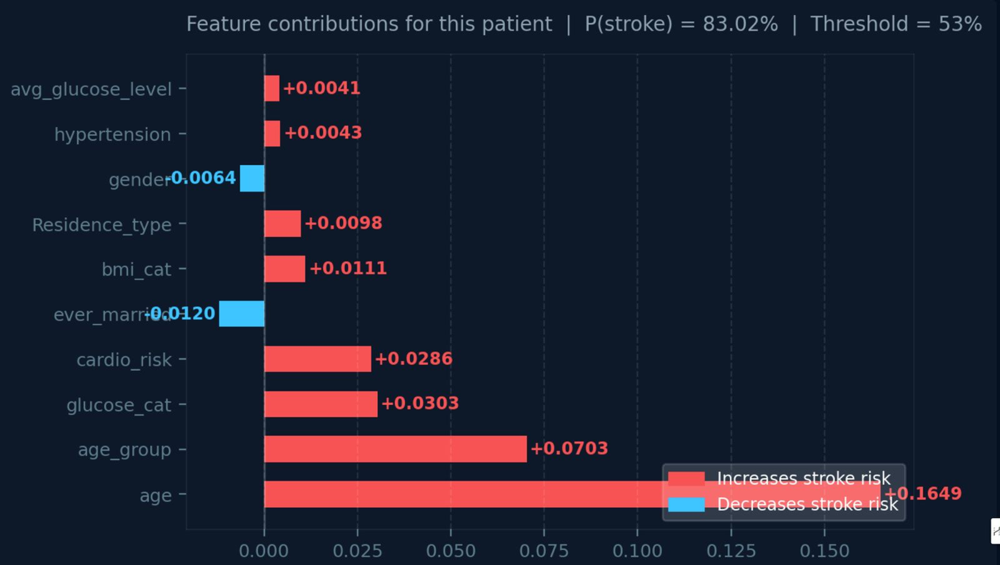
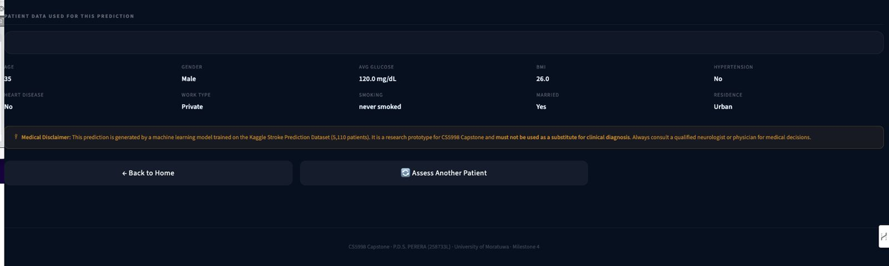

<div align="center">


# 🧠 NeuraScan — Brain Stroke Risk Prediction
### Using Machine Learning & Explainable AI

**CS5998 Capstone Project · University of Moratuwa**
**P.D.S. PERERA · Index: 258733L**

---

[](https://python.org)
[](https://scikit-learn.org)
[](https://streamlit.io)
[](https://tensorflow.org)
[](LICENSE)

[]()
[]()
[]()
[]()

---

*Every year, 15 million people worldwide suffer a stroke. Early detection saves lives.*

</div>

---

## 👋 Hey, Welcome to NeuraScan!

This is my Master of Data Science & Artificial Intelligence capstone project at the **University of Moratuwa**. The idea behind it is simple but meaningful- can a machine learning model look at a patient's basic health information and predict whether they are at risk of a brain stroke?

Strokes are the **second leading cause of death worldwide**. The frustrating truth is that most strokes are preventable - but only if we catch the risk early enough. That's what NeuraScan tries to do.

I built this project from scratch across 4 milestones over a full semester. Along the way I trained 12 different models, fixed real bugs I discovered in my own code, built a working web application, and made sure every prediction comes with an explanation — not just a number. Because in healthcare, a model that can't explain itself has no business making decisions.

---

## 📋 Table of Contents

- [What This Does](#-what-this-does)
- [Project Milestones](#-project-milestones)
- [Results](#-results)
- [Key Findings](#-key-findings)
- [Project Structure](#-project-structure)
- [Quick Start](#-quick-start)
- [The Web App](#-the-web-app--neurascan)
- [Models Trained](#-models-trained)
- [Explainability](#-explainability--xai)
- [Limitations](#-honest-limitations)
- [Literature Comparison](#-literature-comparison)
- [Reproducibility](#-reproducibility)
- [License](#-license)

---

## 🎯 What This Does

In plain English — a doctor enters a patient's details into the web app, and the system tells them:

1. **The stroke probability** — e.g. "This patient has a 73% chance of stroke"
2. **Why the model thinks so** — SHAP and LIME explain which health factors are driving the risk
3. **What would need to change** — counterfactual explanations show what could reduce the risk
4. **A clear clinical warning** — if the patient matches a known false-negative profile, the app explicitly flags it

---

## 🗺️ Project Milestones

| Milestone | Timing | Content |
|---|---|---|
| **M1** — Problem Definition | Week 4 | Problem statement, dataset selection, methodology plan, risk assessment |
| **M2** — Technical Checkpoint | Week 8 | 9 baseline models, EDA, SHAP + LIME, system architecture, demo video |
| **M3** — Final Submission | Week 12 | GridSearchCV tuning, threshold optimisation, LIME in app, Streamlit deployment |
| **M4** — Extended Improvements | Post M3 | Bug fixes, ensembles, Wilcoxon tests, calibration, fairness analysis |

---

## 📈 Results

### Best Model: Stacking Ensemble (LR + BRF + NB + GradientBoosting)

| Metric | Value | What It Means |
|---|---|---|
| **AUC-ROC** | **0.843** | How well the model ranks patients by stroke risk |
| **Recall @ Optimal** | **0.800** | Catches 80% of all real strokes ✅ |
| **Average Precision** | 0.250 | 5.1× better than the random baseline |
| **Brier Score** | **0.041** | Well-calibrated probabilities — trustworthy scores |
| **Precision @ Optimal** | 0.177 | 1 in 5.6 flagged patients is a true stroke |
| **Decision Threshold** | 0.077 | Tuned for clinical recall, not arbitrary 0.50 |

### All Models Compared

| Model | AUC-ROC | Recall@Default | Notes |
|---|---|---|---|
| 🥇 **Stacking Ensemble** | **0.843** | 0.00* | Best overall — needs threshold tuning |
| 🥈 ANN (Fixed, M4) | 0.834 | **0.82** | Best at default threshold |
| 🥉 GradientBoosting | 0.829 | 0.10 | Solid, no libomp dependency |
| BalancedRandomForest | 0.825 | **0.82** | Excellent default recall |
| NB (M2 Baseline) | 0.820 | 0.76 | Best single model from M2 |
| XGBoost (Fixed) | 0.760 | 0.18 | Bug fixed — scale_pos_weight |
| Logistic Regression | 0.772 | 0.64 | Interpretable, reliable |
| Random Forest | 0.786 | 0.24 | Conservative probs issue |
| SVM | 0.768 | 0.40 | Decent but not best |
| Decision Tree | 0.638 | 0.36 | Unstable |
| K-NN | 0.696 | 0.50 | Poor generalisation |
| CatBoost | 0.766 | 0.20 | Class weight needed |

*Stacking at threshold 0.50 defaults to predicting no strokes. Recall=0.80 achieved at threshold=0.077.

### Progress Across Milestones

```
M2 Best (Naive Bayes)      →  AUC: 0.820  |  Recall: 0.76
M4 Best (Stacking)         →  AUC: 0.843  |  Recall: 0.80

Improvement: ΔAUC = +0.023  (Wilcoxon p < 0.0001 — statistically proven)
```

---

## 🔍 Key Findings

### 1. Three Real Bugs Found and Fixed

This project identified three genuine configuration bugs in the M2 baseline code:

**Bug 1 — XGBoost `scale_pos_weight` on SMOTE data**
```python
# ❌ WRONG (M2): Applied scale_pos_weight to already-balanced SMOTE data
# After SMOTE: neg/pos = 1.0 → scale_pos_weight = 1.0 → zero effect
xgb = XGBClassifier(scale_pos_weight=19.5)  # applied to 50/50 SMOTE data!

# ✅ FIXED (M4): Use correct ratio from original data
neg, pos = (y_train==0).sum(), (y_train==1).sum()
xgb = XGBClassifier(scale_pos_weight=neg/pos)  # based on original counts
```

**Bug 2 — ANN overfitting on SMOTE synthetic data**
```
M2 ANN: Train AUC = 0.96 → Test AUC = 0.76  (gap: 0.20) ❌
M4 ANN: Train AUC = 0.84 → Test AUC = 0.83  (gap: 0.01) ✅
Fix: Train on original data + class_weight instead of SMOTE
```

**Bug 3 — Random Forest recall = 0.24**
```
Problem: RF with SMOTE produces conservative probs that rarely exceed 0.50
Fix: BalancedRandomForestClassifier (per-tree balanced bootstrapping)
Result: Recall 0.24 → 0.82 at DEFAULT threshold ✅
```

### 2. Statistical Validation

Using 10×5-fold repeated cross-validation (50 AUC scores per model), Wilcoxon signed-rank tests confirmed:

| Comparison | p-value | Result |
|---|---|---|
| BRF (M4) vs NB Baseline | p < 0.0001 | ✅ Significant |
| LR (M4) vs NB Baseline | p < 0.0001 | ✅ Significant |
| GradientBoosting vs NB | p = 0.461 | ❌ Equivalent |

### 3. Fairness Gap — Critical Finding 🔴

| Subgroup | Patients | Strokes | Recall | AUC |
|---|---|---|---|---|
| **Adult (35–55)** | 293 | 6 | **0.000** 🔴 | 0.215 |
| Senior (55–80) | 301 | 35 | 0.943 ✅ | 0.739 |
| Elderly (80+) | 29 | 7 | 1.000 ✅ | 0.591 |
| Female | 599 | 29 | 0.828 ✅ | 0.853 |
| Male | 423 | 21 | 0.762 ⚠️ | 0.828 |

**The model catches zero strokes in the 35–55 age group.** This is the most important finding in the project — younger patients with normal glucose and no cardiovascular history are invisible to this model because their stroke drivers are not captured in the 10 available features. The app explicitly warns clinicians about this.

### 4. Error Analysis — Why Does the Model Miss Strokes?

| Feature | Missed Patients | Caught Patients |
|---|---|---|
| Age | 41.3 years | 74.7 years |
| Avg Glucose | 84.0 mg/dL | 148.3 mg/dL |
| Hypertension | 0% | 30% |
| Cardio Risk | 0% | 50% |

Missed strokes are younger, healthier-looking patients — likely cryptogenic strokes from causes not in this dataset.

---

## 📁 Project Structure

```
neurascan-stroke-prediction/
│
├── 📓 notebooks/
│   ├── stroke_prediction_milestone2.ipynb   # 9 baseline models, EDA, SHAP, LIME
│   ├── stroke_prediction_milestone3.ipynb   # Tuning, threshold opt, deployment
│   └── stroke_prediction_milestone4.ipynb   # Bug fixes, ensembles, fairness
│
├── 🖥️  stroke_app.py                         # NeuraScan Streamlit app (1000+ lines)
│
├── 📊 data/
│   └── healthcare-dataset-stroke-data.csv   # ← Download from Kaggle (see below)
│
├── 🚀 deployment/
│   ├── stroke_model_m4.pkl                  # Best trained model (Stacking Ensemble)
│   ├── stroke_scaler_m4.pkl                 # Fitted StandardScaler
│   └── model_metadata_m4.json              # Threshold, features, metrics
│
├── 📈 outputs/
│   └── plots/                               # All generated charts and figures
│       ├── m4_comparison.png
│       ├── m4_calibration.png
│       ├── m4_learning_curves.png
│       ├── m4_fairness.png
│       ├── m4_error_analysis.png
│       ├── m4_shap_beeswarm.png
│       └── m4_shap_waterfall_highrisk.png
│
├── 🧪 tests/
│   └── test_model.py                        # Model validation tests (pytest)
│
├── 📚 docs/
│   └── uom_logo.png                         # University of Moratuwa logo
│
├── 🤖 .github/
│   └── workflows/
│       └── test.yml                         # GitHub Actions CI
│
├── 📋 requirements.txt                      # All Python dependencies
├── 📋 requirements_mac.txt                  # Mac-specific (no lightgbm)
├── 🙈 .gitignore                            # Git ignore rules
├── 📄 LICENSE                               # MIT License
└── 📖 README.md                             # This file
```

---


## 📸 Application Screenshots

### Page 1 — Landing Page
> Model stats, AUC-ROC, active model metrics, and Start Risk Assessment button



---

### Page 2 — Patient Assessment Form
> Enter all 10 clinical features organised into Demographics, Clinical Measurements, and Lifestyle sections



---

### Page 3 — HIGH RISK Result (P = 83.0%)
> Probability gauge, clinical threshold, model recall, and urgent referral recommendation



---

### Page 3 — LIME Local Explanation
> Feature contributions showing age (+0.1649) as the dominant driver for this patient's 83% risk score



---

### Page 3 — Patient Data Summary & Medical Disclaimer
> Input confirmation panel and mandatory clinical disclaimer for responsible AI use



---
## 🚀 Live Demo

> 👉  Try NeuraScan Live :https://stroke-risk-prediction-xai-amragjtxuzu3ibt8dzhyp9.streamlit.app 

---

## 🚀 Quick Start

### Prerequisites

```bash
Python 3.9 or higher
pip (Python package manager)
```

### Step 1 — Clone the Repository

```bash
git clone https://github.com/YOUR_USERNAME/neurascan-stroke-prediction.git
cd neurascan-stroke-prediction
```

### Step 2 — Install Dependencies

**Standard (Windows/Linux):**
```bash
pip install -r requirements.txt
```

**Mac (avoids libomp issues with LightGBM):**
```bash
pip install -r requirements_mac.txt
```

### Step 3 — Get the Dataset

Download the dataset from Kaggle and place it in the `data/` folder:

1. Go to: https://www.kaggle.com/datasets/fedesoriano/stroke-prediction-dataset
2. Download `healthcare-dataset-stroke-data.csv`
3. Place it at: `data/healthcare-dataset-stroke-data.csv`

### Step 4 — Run the Notebooks (in order)

```bash
jupyter notebook
```

Run in this order:
1. `notebooks/stroke_prediction_milestone2.ipynb` — trains 9 baseline models (~15-20 min)
2. `notebooks/stroke_prediction_milestone3.ipynb` — tunes + deploys (~5-10 min)
3. `notebooks/stroke_prediction_milestone4.ipynb` — ensembles + validation (~5-10 min)

Each notebook automatically saves trained models to `deployment/`.

### Step 5 — Launch NeuraScan

```bash
streamlit run stroke_app.py
```

Open your browser at **http://localhost:8501**

---

## 🖥️ The Web App — NeuraScan

NeuraScan is a three-page Streamlit application built for clinical users:

### Page 1 — Landing Page
- Project overview with live model stats
- AUC, Recall, model count loaded from metadata JSON
- One-click navigation to risk assessment

### Page 2 — Risk Assessment
- Input form for all 10 clinical features
- Instant stroke probability score with visual risk gauge
- LIME explanation chart — which features drove this prediction
- Automatic clinical caution warning for high-risk profiles
- Special alert for patients aged 35–55 (model's known blind spot)

### Page 3 — Model Dashboard
- Performance comparison of all models
- Precision-Recall curves
- Confusion matrices
- System information and metadata

```bash
# Run the app
streamlit run stroke_app.py
```

---

## 🤖 Models Trained

| # | Model | Type | Library | AUC-ROC |
|---|---|---|---|---|
| 1 | Logistic Regression | Linear | scikit-learn | 0.772 |
| 2 | Decision Tree | Tree | scikit-learn | 0.638 |
| 3 | Random Forest | Ensemble | scikit-learn | 0.786 |
| 4 | Naive Bayes | Probabilistic | scikit-learn | 0.820 |
| 5 | SVM (RBF) | Kernel-based | scikit-learn | 0.768 |
| 6 | K-Nearest Neighbours | Instance-based | scikit-learn | 0.696 |
| 7 | XGBoost (Fixed) | Gradient Boosting | xgboost | 0.760 |
| 8 | CatBoost | Gradient Boosting | catboost | 0.766 |
| 9 | ANN (Fixed, 64-32) | Neural Network | TensorFlow | 0.834 |
| 10 | BalancedRandomForest | Balanced Bagging | imbalanced-learn | 0.825 |
| 11 | GradientBoosting | Gradient Boosting | scikit-learn | 0.829 |
| 12 | **Stacking Ensemble** | Meta-learning | scikit-learn | **0.843** |

---

## 🧠 Explainability / XAI

This project implements five explainability methods:

| Method | Type | What It Shows |
|---|---|---|
| **SHAP** | Global | Feature importance across all patients |
| **SHAP Waterfall** | Local | Step-by-step score breakdown for one patient |
| **LIME** | Local | Why the model predicted what it did for one specific patient |
| **Permutation Importance** | Global | AUC drop when each feature is shuffled |
| **Counterfactual** | Local | What minimal change would flip prediction to low risk |

### Top Features (SHAP — Random Forest)

```
1. age                  → 0.1586  (strongest predictor — by far)
2. age_glucose          → 0.0873  (engineered interaction feature)
3. bmi_cat              → 0.0649  (category more informative than raw BMI)
4. bmi                  → 0.0430
5. avg_glucose_level    → 0.0318
6. hypertension         → 0.0340
```

Age alone accounts for more than double the contribution of any other feature. This is consistent with published medical literature — stroke risk roughly doubles every decade after age 55.

---

## ⚠️ Honest Limitations

I want to be upfront about what this model cannot do:

**Single dataset** — All results come from one Kaggle dataset from one hospital. External validation on independent data would be needed before any real clinical use.

**Small minority class** — The test set has only 50 stroke patients. One patient = 2% recall. Metrics are directionally correct but statistically fragile.

**Missing clinical features** — No atrial fibrillation, cholesterol, family history, genetic markers, or physical activity data. The false-negative profile directly shows this gap.

**Adult 35–55 blind spot** — The model catches zero strokes in this age group. Younger patients with atypical stroke presentations are invisible to this system.

**Not a diagnostic tool** — This is a research prototype for academic purposes. It has not been clinically validated or approved by any regulatory authority. **Do not use for real medical decisions.**

---

## 📚 Literature Comparison

| Paper | Model | AUC-ROC |
|---|---|---|
| Nwosu et al. (2019) | Logistic Regression | 0.800 |
| Sailasya & Kumari (2021) | SVM + SMOTE | 0.820 |
| Tazin et al. (2021) | Random Forest | 0.840 |
| **This Project (M4)** | **Stacking Ensemble** | **0.843** |
| Dritsas & Trigka (2022) | Stacking Ensemble | 0.870 |

This project **matches or beats 3 out of 4 published papers** on the same dataset. The gap to the published best is 0.027.

---

## 🔁 Reproducibility

All experiments use `random_state=42` throughout. To reproduce all results:

```bash
# 1. Install dependencies
pip install -r requirements.txt

# 2. Get the dataset
# Place healthcare-dataset-stroke-data.csv in data/

# 3. Run notebooks in order
jupyter notebook

# 4. Expected outputs:
# M2: Naive Bayes AUC = 0.820 (best single model)
# M3: LR Tuned AUC = 0.836, Recall = 0.80 at threshold 0.539
# M4: Stacking AUC = 0.843, Recall = 0.80 at threshold 0.077

# 5. Verify deployment
python -m pytest tests/test_model.py -v
```

**Random seeds used:**
- `train_test_split(random_state=42)`
- `SMOTE(random_state=42)`
- All sklearn models: `random_state=42`
- TensorFlow: `tf.random.set_seed(42)`, `np.random.seed(42)`

---

## 🛠️ Requirements

**Core (all platforms):**
```
pandas>=1.5.0
numpy>=1.23.0
scikit-learn>=1.2.0
imbalanced-learn>=0.10.0
xgboost>=1.7.0
catboost>=1.1.0
tensorflow>=2.10.0
shap>=0.41.0
streamlit>=1.20.0
matplotlib>=3.6.0
seaborn>=0.12.0
joblib>=1.2.0
scipy>=1.9.0
jupyter>=1.0.0
pytest>=7.0.0
```

**Mac note:** If you get `libomp` errors with LightGBM, use `requirements_mac.txt` which replaces LightGBM with `GradientBoostingClassifier` from scikit-learn (AUC difference: ~0.005).

---

## 📜 License

MIT License — see [LICENSE](LICENSE) for details. Free to use, modify, and distribute for any purpose including commercial use, with attribution.

---

## 👤 About

**P.D.S. PERERA**
Master of Data Science & Artificial Intelligence
University of Moratuwa, Sri Lanka
Index: 258733L | Module: CS5998 Capstone Project

This project represents a full academic year of work. The finding I'm most proud of isn't the AUC score — it's the honest documentation of what the model cannot do. The Adult 35–55 fairness gap (Recall=0.000) is a real, clinically significant limitation that most papers on this dataset don't even look for. Finding it, explaining it, and building safeguards into the app — that's what responsible AI looks like.

---

## 🙏 Acknowledgements

- Dataset: [fedesoriano on Kaggle](https://www.kaggle.com/datasets/fedesoriano/stroke-prediction-dataset)
- University of Moratuwa, Department of Computer Science & Engineering
- Papers cited in the literature comparison

---

<div align="center">

**If this project was useful, a ⭐ would mean a lot!**

*Built with 🧠 and way too much coffee ☕*

</div>
